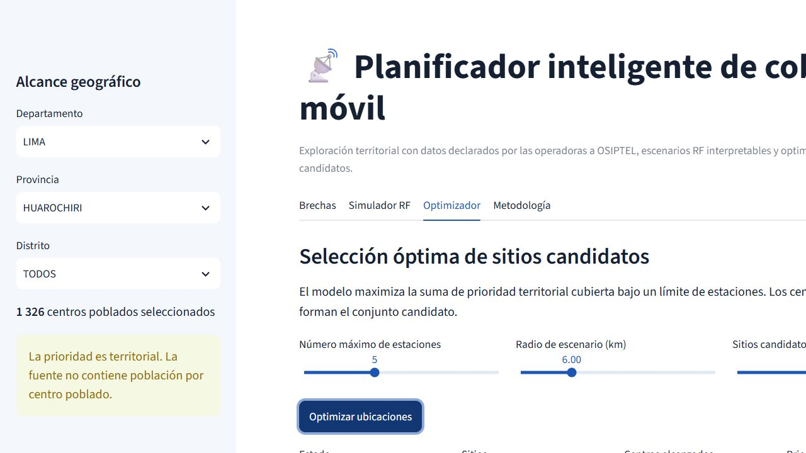
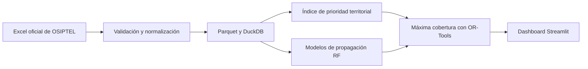

# Planificador inteligente de cobertura móvil — Perú

Proyecto académico de telecomunicaciones y ciencia de datos que identifica
brechas territoriales de cobertura 4G/5G, simula escenarios de propagación
radioeléctrica y propone ubicaciones candidatas para nuevas estaciones mediante
optimización matemática.

Lo desarrollé como estudiante de **Ingeniería Electrónica de la Universidad
Nacional de Ingeniería (UNI), Perú**, con el objetivo de aplicar programación,
análisis de datos y fundamentos de comunicaciones inalámbricas a un problema
relevante del país.

> El resultado es una herramienta de prefactibilidad académica. No reemplaza
> mediciones de campo, planificación RF ni ingeniería de detalle.



## Resultados destacados

| Indicador | Resultado |
|---|---:|
| Centros poblados procesados en el Perú | 108 115 |
| Centros analizados en el piloto de Huarochirí | 1 326 |
| Centros con condición 4G crítica en Huarochirí | 597 |
| Sitios elegidos en el escenario demostrativo | 5 |
| Centros cubiertos por el escenario optimizado | 257 |
| Prioridad territorial cubierta | 18,71 % |
| Mejora frente a la media de 1 000 selecciones aleatorias | 136,59 % |
| Pruebas automatizadas | 11 aprobadas |

El escenario demostrativo usa cinco sitios, un radio de 6 km y los 120 centros
con mayor prioridad como candidatos. La comparación aleatoria valida el
comportamiento del algoritmo bajo estos supuestos; no representa cobertura real
en campo.

## ¿Qué permite hacer?

- Filtrar y explorar brechas por departamento, provincia y distrito.
- Comparar cobertura garantizada y total por operador y tecnología.
- Visualizar centros poblados y su prioridad territorial sobre un mapa.
- Configurar frecuencia, potencia, ganancias, pérdidas, sensibilidad y margen.
- Comparar FSPL, Okumura-Hata y COST-231 Hata.
- Seleccionar número de estaciones, radio y cantidad de candidatos.
- Resolver un problema de máxima cobertura con OR-Tools CP-SAT.
- Descargar las ubicaciones propuestas en CSV.

## Dashboard interactivo

La aplicación está construida con Streamlit y se divide en cuatro módulos:

1. **Brechas:** filtros territoriales, mapa, indicadores y operadores.
2. **Simulador RF:** presupuesto de enlace, curvas y alcance aproximado.
3. **Optimizador:** selección de sitios y descarga de resultados.
4. **Metodología:** fórmulas, supuestos y limitaciones.

## Stack tecnológico

| Área | Tecnologías |
|---|---|
| Procesamiento | Python 3.12, pandas, NumPy |
| Análisis espacial | GeoPandas, Shapely, PyProj |
| Almacenamiento | Parquet, DuckDB, SQL |
| Telecomunicaciones | FSPL, Okumura-Hata, COST-231 Hata, link budget |
| Optimización | OR-Tools CP-SAT |
| Visualización | Streamlit, Plotly, PyDeck |
| Calidad | pytest, Ruff, GitHub Actions |
| Portabilidad | Docker |

## Arquitectura



## Fuente de datos

La fuente principal es **Porcentaje de cobertura móvil por centro poblado,
empresa operadora y tecnología**, publicada por OSIPTEL en la Plataforma Nacional
de Datos Abiertos:

<https://www.datosabiertos.gob.pe/dataset/porcentaje-de-cobertura-m%C3%B3vil-por-centro-poblado-empresa-operadora-y-tecnolog%C3%ADa>

Los datos distinguen cobertura garantizada (`CG`) y cobertura total, formada por
cobertura garantizada más capacidad adicional de red (`CG+CAR`). El recurso
declara cobertura nacional para 2025 y licencia Open Data Commons Attribution.
La atribución completa está disponible en [`NOTICE.md`](NOTICE.md).

## Índice de prioridad territorial

El puntaje de 0 a 100 es una suma ponderada e interpretable:

| Componente | Peso |
|---|---:|
| Brecha de cobertura 4G garantizada | 45 % |
| Brecha de cobertura 4G total | 20 % |
| Brecha de cobertura 5G total | 15 % |
| Baja diversidad de operadores 4G | 10 % |
| Prioridad rural explícita | 10 % |

La fuente no incluye población por centro poblado. Por ello, el indicador mide
**prioridad territorial**, no impacto poblacional ni retorno financiero.

## Ejecutar localmente

Requiere Python 3.12. El archivo Parquet ya está incluido, por lo que no es
necesario descargar el Excel para explorar la aplicación.

### Windows PowerShell

```powershell
git clone https://github.com/rafadz4/planificador-cobertura-movil-peru.git
cd planificador-cobertura-movil-peru
python -m venv .venv
.\.venv\Scripts\Activate.ps1
python -m pip install -e ".[dev]"
streamlit run app.py
```

### Linux o macOS

```bash
git clone https://github.com/rafadz4/planificador-cobertura-movil-peru.git
cd planificador-cobertura-movil-peru
python3.12 -m venv .venv
source .venv/bin/activate
python -m pip install -e ".[dev]"
streamlit run app.py
```

## Reconstruir los datos

```powershell
python scripts/download_data.py --output data/raw/osiptel_coverage.xlsx
python scripts/build_dataset.py --input data/raw/osiptel_coverage.xlsx
```

Si un proxy corporativo interfiere con la validación TLS, el descargador ofrece
la opción explícita `--insecure`, desactivada por defecto.

## Consultas SQL

El proyecto incluye ejemplos en `sql/coverage_summary.sql` y
`sql/huarochiri_top_candidates.sql`. También se puede consultar DuckDB desde
Python:

```powershell
python -c "import duckdb; duckdb.sql(\"ATTACH 'data/processed/coverage.duckdb'; SELECT * FROM coverage.huarochiri_priority LIMIT 10\").show()"
```

## Pruebas y calidad

```powershell
ruff check .
pytest -q
```

La integración continua repite estas verificaciones con GitHub Actions en cada
`push` y `pull request`.

## Docker

```bash
docker build -t coverage-planner-peru .
docker run --rm -p 8501:8501 coverage-planner-peru
```

## Estructura

```text
app.py                         Dashboard Streamlit
src/coverage_planner/          Datos, modelos RF y optimización
scripts/                       Descarga y construcción reproducible
data/processed/                Parquet, DuckDB, muestra y control de calidad
sql/                           Consultas analíticas
tests/                         Pruebas automatizadas
docs/                          Diccionario, captura e informe técnico
```

## Limitaciones técnicas

- La cobertura proviene de información reportada por empresas operadoras a
  OSIPTEL.
- Los escenarios RF no incorporan relieve, clutter, azimut, tilt, sectorización,
  interferencia ni carga de red.
- Los radios del optimizador son círculos geodésicos simplificados.
- Los candidatos se ubican en centros poblados, no en predios validados.
- El optimizador maximiza prioridad territorial, no población ni rentabilidad.
- Los resultados requieren drive tests y revisión de un ingeniero RF antes de
  cualquier decisión de despliegue.

## Documentación

- [Informe técnico y resultados](docs/INFORME_FINAL.md)
- [Diccionario de datos](docs/DATA_DICTIONARY.md)
- [Atribución de la fuente](NOTICE.md)

## Autor

**Rafael Elias**  
Estudiante de Ingeniería Electrónica — Universidad Nacional de Ingeniería (UNI),
Perú.

Este proyecto forma parte de mi portafolio en telecomunicaciones, análisis de
datos y optimización.

## Licencia

El código se distribuye bajo la [licencia MIT](LICENSE). Los datos conservan los
términos y la atribución indicados por su fuente oficial.

